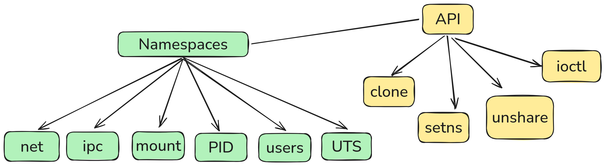
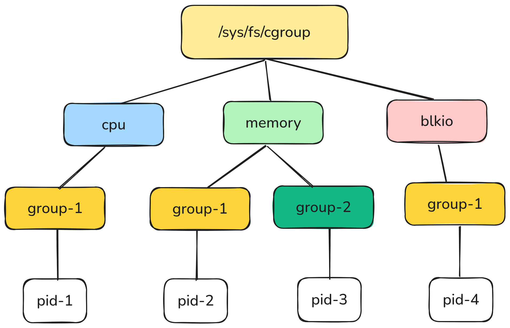
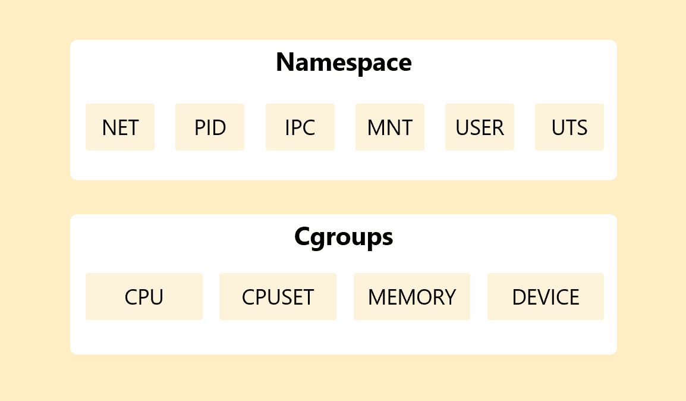

# Introduction to Containers

## Namespaces & cgroups: building blocks

---

# What Are Containers?

- Lightweight isolation mechanism
- Share the host kernel
- Combine:
  - **Namespaces** → isolate what a process can *see*
  - **cgroups** → limit what a process can *use*
- Goal today: build a container by hand

---

# Namespaces Overview

- **Namespaces** partition kernel resources
- A process sees its own view of:
  - Hostname (UTS)
  - Mount table (Mount namespace)
  - Process tree (PID)
- We’ll demo: **UTS**, **Mount**, **PID**

---

# namespaces



---

# UTS + Mount Namespace Demo

```bash
sudo unshare --uts --mount --fork /bin/bash
```

- `unshare`: userland tool to detach from namespaces
- `--uts`: new hostname/UTS namespace
- `--mount`: new mount namespace (private mount table)

**Try inside:**

```bash
hostname mycontainer
hostname     # shows "mycontainer"
exit
hostname     # unchanged on host
```

---

# Mount Namespace in Action

```bash
sudo unshare --mount --fork /bin/bash
mount -t tmpfs none /mnt
touch /mnt/hello.txt
ls /mnt        # file visible here
exit
ls /mnt        # mount disappeared
```

- Each mount namespace has its own view of mounts

---

# PID Namespace

```bash
sudo unshare --pid --fork --mount-proc /bin/bash
```

- `--pid`: new PID namespace (first process becomes **PID 1**)
- `--mount-proc`: mount a fresh `/proc` so tools show only local processes

**Try:**
```bash
echo $$   # shows 1
ps -ef    # only shows processes in this namespace
```

---

# History

[Linux Kernel 2.6.16 - 2006 - Add unshare system call](https://kernelnewbies.org/Linux_2_6_16)

```bash
$ man unshare
```

```bash
$ man 2 unshare
```

---

# cgroups Overview

- **cgroups** = control groups
- Limit & account for resources:
  - CPU
  - Memory
  - (Also I/O, pids, devices, etc.)
- Unified hierarchy: `/sys/fs/cgroup` (cgroup v2)

---

# cgroups



---

# CPU cgroup Demo (~10% CPU)

```bash
mount -t cgroup2 none /sys/fs/cgroup || true
sudo mkdir -p /sys/fs/cgroup/mydemo

yes > /dev/null &
pid=$!
echo 10000 100000 | sudo tee /sys/fs/cgroup/mydemo/cpu.max
echo $pid | sudo tee /sys/fs/cgroup/mydemo/cgroup.procs
```

- Limits the process to ~10% CPU
- Verify with `top` or `htop`

---

# Memory cgroup Demo (50 MB)

```bash
sudo mkdir -p /sys/fs/cgroup/memorydemo
echo $((50*1024*1024)) | sudo tee /sys/fs/cgroup/memorydemo/memory.max

python3 -c "a = ' ' * 100_000_000; print('Allocated\!'); input()" &
pid=$!

echo $pid | sudo tee /sys/fs/cgroup/memorydemo/cgroup.procs
```

- Memory limit = **50 MB**
- Process should be killed by OOM (SIGKILL) when exceeding the limit

---

# History

[Linux Kernel 2.6.12 - 2005 - Add cpusets](https://kernelnewbies.org/Linux_2_6_12)

[Linux Kernel 2.6.24 - 2008 - Add CONFIG_CGROUPS kernel configuration option](https://kernelnewbies.org/Linux_2_6_24)

```bash
$ man cpuset
```

```bash
$ man cgroups
```

---

# namespaces vs cgroups



---

# Build a Container by Hand

1) **Create a cgroup**

```bash
sudo mkdir -p /sys/fs/cgroup/mycontainer
echo 200M | sudo tee /sys/fs/cgroup/mycontainer/memory.max
echo 20000 100000 | sudo tee /sys/fs/cgroup/mycontainer/cpu.max
```

2) **Start isolated namespaces**

```bash
sudo unshare --pid --uts --mount --fork --mount-proc /bin/bash
```

3) **Inside the shell**

```bash
hostname tinybox
echo $$ > /sys/fs/cgroup/mycontainer/cgroup.procs
```

---

# What We Just Built

- A “hand-rolled container”:
  - Own **PID/UTS/Mount namespaces**
  - CPU & memory limits via **cgroups**
- Docker/Kubernetes add:
  - Images & layers
  - Networking
  - Orchestration & scheduling

---

# Container Ecosystem Timeline

### **Early 2000s**

* **2003–2004** → Google begins developing **Borg** internally to manage massive clusters.
* **2004** → Linux adds **cpusets** (Linux 2.6.12), an early precursor to cgroups, letting admins bind processes to specific CPUs/memory nodes.

---

### **Mid 2000s**

* **2006 (Linux 2.6.16)** → First **namespaces**:

  * UTS (hostname isolation)
  * IPC (System V / POSIX IPC isolation)

* **2007 (Linux 2.6.23)** → **User namespace** (initial version, not fully usable yet).

* **2008 (Linux 2.6.24)** →

  * **cgroups** (merged into kernel, originally “process containers”)
  * **PID namespace**
  * **Network namespace**

  ➝ These gave Linux the **foundations for real containers**.

* **2008** → **LXC (Linux Containers)** project, combining cgroups + namespaces.

---

### **2010s**

* **2013** → **Docker** launches, building on LXC but focusing on developer-friendly workflows, image distribution, and portability.
* **2015** → Google publishes the **Borg paper**, revealing details of its internal system.
* **2016 (Linux 4.5)** → **cgroups v2** merged, simplifying and unifying the cgroup hierarchy.

---

### **Late 2010s – 2020s**

* **2016** → Kubernetes (inspired by Borg/Omega) becomes the de facto orchestration system.
* **2016 (Linux 4.6)** → **Cgroup namespaces** added.
* **2020 (Linux 5.6)** → **Time namespaces** added.

---

**Summary**:

* **Borg**: 2003–2004 (Google-only, ran without mainline cgroups/namespaces).
* **Linux primitives (cgroups + namespaces)**: 2006–2008 → enabled open-source containers.
* **LXC/Docker**: 2008–2013 → popularized containers globally.
* **Kubernetes**: 2014+ → orchestration layer inspired by Borg.

---

# Demo

- Namespaces
- Cgroups
- memhog (C program)
- ns-cgroup (C program)

---

# Thanks!

- Convert to **HTML / PDF / PPTX** with **Marp**
- Q&A
