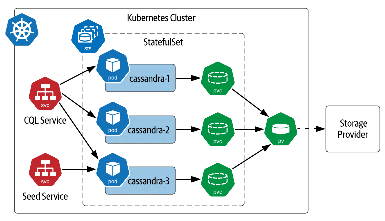

# Session 2 — Theory

**Goal:** Configuration, Networking, Storage, Deployments, StatefulSet, Scaling

---

# Configuration Management

- **ConfigMaps**
  - Store non-sensitive config data (env vars, files)
  - Decouple configuration from container images

- **Secrets**
  - Store sensitive data (passwords, API keys)
  - Base64-encoded (not encrypted by default)

- **Use cases**
  - Inject into environment variables
  - Mount as files inside Pods

---

# Networking & Ingress

- **Service discovery**
  - Built-in DNS: Pods and Services discover each other by name
  - Example:
    - `http://myservice.default.svc.cluster.local`

- **Ingress controllers**
  - Provide external HTTP/HTTPS access to Services
  - Handle routing, TLS termination, virtual hosts
  - Example: Traefik (default in k3d)

---

# Storage Overview

- **Volumes**
  - Attach ephemeral storage to Pods
  - Lifecycle tied to Pod

- **Persistent Volumes (PV)**
  - Cluster-wide storage resource

- **Persistent Volume Claims (PVC)**
  - User request for storage (binds to PV)

- **Use case**
  - Keep data across Pod restarts

---

# Scaling & Self-Healing

---

# ReplicaSets

- Ensure a specified number of **Pod replicas** are always running  
- If Pods die → new ones created  
- If too many Pods → extras are removed  
- Usually managed **indirectly** via a Deployment  

👉 Example:
```bash
kubectl get rs
```

---

# Deployments

- Manage **stateless applications**  
- Use **ReplicaSets** underneath  
- Pods are **interchangeable**:  
  - No stable identity (Pod names can change)  
  - No stable storage (unless using PVCs)  
- Use cases:  
  - Web servers  
  - API services  

👉 Example:
```bash
kubectl create deployment web --image=nginx
```

---

# Self-healing

- Kubernetes constantly **monitors Pod health**  
- If a Pod crashes, is deleted, or a Node fails:  
  - ReplicaSet (via Deployment) **recreates missing Pods**  
- Resilience is **automatic** — no manual restart needed  

👉 Example:
```bash
kubectl delete pod <pod-name>
kubectl get pods   # New Pod appears
```

---

# Horizontal Pod Autoscaler (HPA)

- **Scales replicas automatically** based on metrics  
- Default metrics: **CPU, memory** (custom possible)  
- Works with Deployments, ReplicaSets, StatefulSets  

👉 Example:
```bash
kubectl autoscale deployment web --min=2 --max=5 --cpu=70
kubectl get hpa
```

- Adjusts replicas between 2 and 5 to keep average CPU ~70%

---

# HPA


---

# StatefulSets

- Manage **stateful applications**  
- Pods have a **stable identity** (name & ordinal index: `pod-0`, `pod-1`, …)  
- Each Pod can get its own **Persistent Volume** (stable storage)  
- Ordered deployment and scaling  
- Use cases:  
  - Databases (Cassandra, PostgreSQL)  
  - Kafka, Zookeeper  
  - Applications needing stable network IDs  

👉 Example:
```bash
kubectl create statefulset db --image=postgres
```

---

# StatefulSets



---

# Deployments vs StatefulSets

| Feature                  | Deployment        | StatefulSet         |
|--------------------------|------------------|---------------------|
| Pod identity             | Not stable       | Stable (`pod-0`, etc.) |
| Storage                  | Shared / ephemeral | Dedicated PV per Pod |
| Scaling behavior         | Random order     | Ordered (0 → n)     |
| Common use case          | Stateless apps   | Databases, stateful apps |

💡 Rule of thumb:  
- Use **Deployment** for *stateless apps*  
- Use **StatefulSet** for *stateful apps*  

---

# Recap (Theory)

- **Scaling & Self-healing** → ReplicaSets, HPA
- **Deployments vs StatefulSets** → stateless vs stateful apps
- **Config management** → ConfigMaps, Secrets
- **Networking** → DNS service discovery, Ingress controllers
- **Storage** → Volumes, PVs, PVCs

👉 Next: hands-on with k3d
